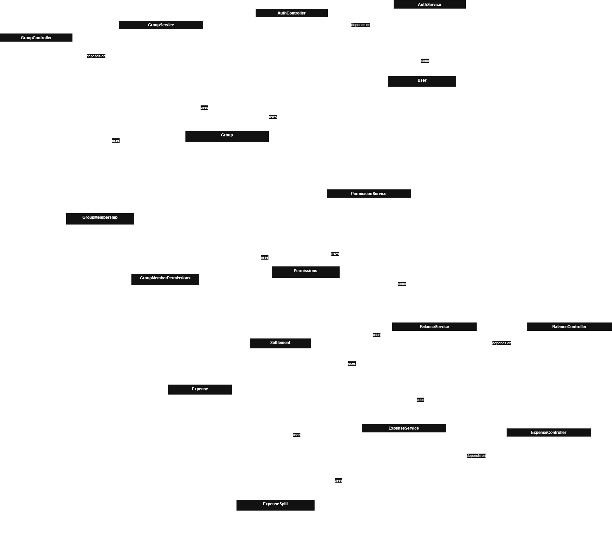

# expense-splitter
Application to split expenses between a group of people.

## Primary Features
- [] Create goups and add members to the group
- [] Add expenses of the group members along with its details
- [] Calculate the debts between the group members
- [] Mark debts as settled

## System Diagrams
[draw.io](https://drive.google.com/file/d/1aj32-vxSlhVDc_q3GGFY4uoIs1wKdHva/view?usp=sharing)

1. Use Case Diagram

2. Sequence Diagram

3. Activity Diagram

4. Class Diagram

5. ER Diagram

